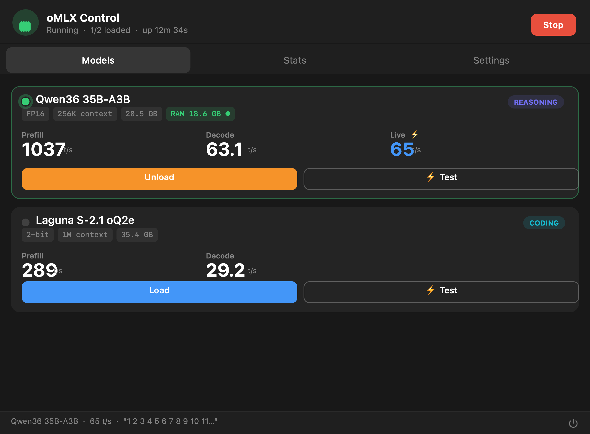
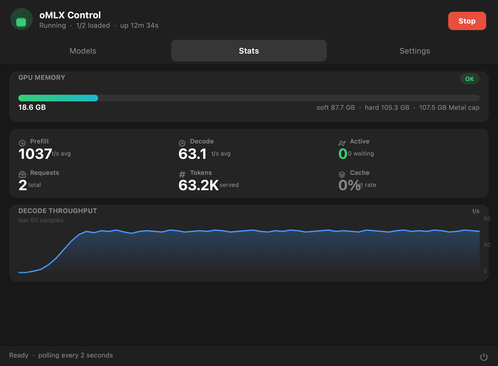
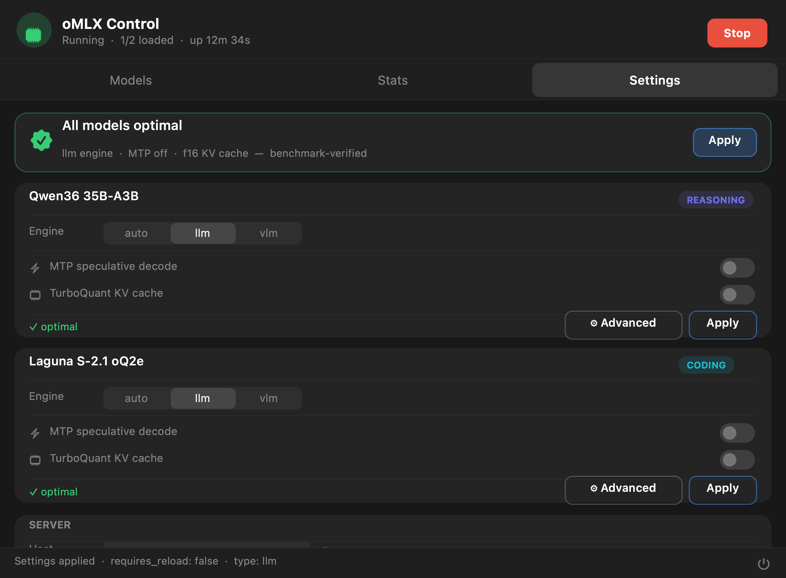

# oMLX Control

> A native macOS menu bar control panel for local LLM inference via [oMLX](https://github.com/jundot/omlx). Manage models, monitor real-time GPU memory and throughput, and tune all 23 oMLX settings — without leaving the menu bar.


---

## Screenshots

### Models Tab
Load and unload models, monitor live status, and test inference speed in one click. The green border and indicator dot show which model is currently resident in GPU memory. Benchmark numbers (Prefill / Decode / Live) update after each test run.



---

### Stats Tab
Real-time GPU memory pressure bar with soft and hard limits, a 6-metric grid showing prefill/decode throughput, request counts, total tokens served, and cache hit rate, plus a 60-sample rolling decode throughput chart.



---

### Settings Tab
One-click "All models optimal" preset applies the benchmark-verified configuration to every model. Per-model cards expose the engine picker, MTP toggle, and TurboKV toggle. The **Advanced** button opens a full panel covering all 23 oMLX settings.



---

## Features

| Feature | Detail |
|---|---|
| **Server control** | Start / Stop oMLX with configurable host, port, and memory-guard tier |
| **Tailscale support** | One-click Tailscale IP detection — bind to tailnet only, not public |
| **Model cards** | Role badge (Reasoning/Coding), quant/context/weight chips, live loaded-RAM chip, Prefill + Decode + Live t/s |
| **Load / Unload** | POST to oMLX Admin API; green indicator + card border when loaded |
| **Live inference test** | Fires a real inference call, measures actual decode t/s against the running model |
| **GPU memory pressure bar** | Color-coded ok → warning → high → critical with soft/hard/cap limits |
| **Decode throughput chart** | 60-sample rolling area chart via Swift Charts, auto-scaling y-axis |
| **Optimal preset** | One button applies all benchmark-validated settings across all models |
| **Basic per-model settings** | Engine type (auto/llm/vlm), MTP toggle, TurboKV toggle, Apply button |
| **Advanced settings panel** | Full 23-field oMLX settings sheet — see below |

---

## Benchmark Results

All benchmarks run on **Apple M1 Ultra (128 GB unified memory)**, oMLX 0.5.3, isolated runs with 0 B GPU active before each measurement, 64K context window.

| Model | Quant | Weights | Prefill t/s | Decode t/s | Context |
|---|---|---|---|---|---|
| **Qwen3.6-35B-A3B** | FP16 (no quant) | 20.5 GB | **1037** | **63.1** | 256K native |
| **Laguna S-2.1 oQ2e** | 2-bit MLX | 35.4 GB | 289 | 29.2 | 1M (sliding-window attn) |

**Combined footprint: 55.9 GB** — both models load simultaneously within the 107.5 GB default Metal cap at 64K context, with ~52 GB headroom.

**Routing:** Use Qwen for reasoning, architecture decisions, and analysis. Use Laguna for code generation and tasks requiring direct output without CoT overhead.

Full benchmark scripts and results: [ttarif/local-model-benchmarks](https://github.com/ttarif/local-model-benchmarks)

---

## Advanced Settings

Click **⚙ Advanced** on any model card in the Settings tab to open a full-height sheet covering all 23 oMLX model settings:

### Engine
| Field | Description |
|---|---|
| `model_type_override` | `auto` = let oMLX decide · `llm` = force batched text engine · `vlm` = force vision engine |
| `trust_remote_code` | Allow loading custom tokenizer code from the model repository |

### MTP (Multi-Token Prediction)
| Field | Description |
|---|---|
| `mtp_enabled` | Draft + verify multiple tokens per step using embedded MTP head |
| `vlm_mtp_enabled` | MTP for vision-language models |

### SpecPrefill
| Field | Description |
|---|---|
| `specprefill_enabled` | Speculative prefill — reduces TTFT by drafting tokens during prompt processing |

### DFlash — Laguna only
| Field | Description |
|---|---|
| `dflash_enabled` | Poolside DFlash speculative decoding |
| `dflash_in_memory_cache` | Cache KV state in RAM for instant session restore |
| `dflash_in_memory_cache_max_entries` | Max in-memory cached sessions (default: 4) |
| `dflash_in_memory_cache_max_bytes` | In-memory cache size limit (default: 8 GB) |
| `dflash_ssd_cache` | Spill sessions to NVMe for persistent prefix cache across restarts |
| `dflash_ssd_cache_max_bytes` | SSD cache size limit (default: 20 GB) |

### DSpark — Bonsai only
| Field | Description |
|---|---|
| `dspark_enabled` | DeepSeek-style speculative decoding |
| `dspark_max_draft_tokens` | Speculative chain depth (default: 2) |

### KV Cache Quantization
| Field | Description |
|---|---|
| `turboquant_kv_enabled` | Quantize KV cache to reduce GPU memory (~1–2% quality cost) |
| `turboquant_kv_bits` | KV precision: `4` or `8` bits |
| `turboquant_skip_last` | Keep final KV layer in f16; quantize all others |

### Sampling & Reasoning
| Field | Description |
|---|---|
| `force_sampling` | Override model-specific sampling constraints |
| `thinking_budget_enabled` | Cap token budget for `<think>…</think>` reasoning blocks |
| `guided_grammar_enabled` | Enable constrained decoding / LBNF grammar enforcement |

### Visibility
| Field | Description |
|---|---|
| `is_pinned` | Pin model — loads on server startup |
| `is_default` | Use this model when no model ID is specified in requests |
| `is_favorite` | Mark as favourite |
| `is_hidden` | Hide from `/v1/models` list (still accessible by ID) |

---

## Requirements

- macOS 14.0+
- Xcode (full install) — required for SwiftUI `MenuBarExtra` and macro support
- [oMLX](https://github.com/jundot/omlx) installed at `~/.local/share/omlx-*/bin/omlx`

---

## Build & Install

```bash
git clone https://github.com/ttarif/omlx-control
cd omlx-control
./build.sh
```

`build.sh` detects Xcode automatically, compiles a release binary, assembles the `.app` bundle with `Info.plist` and `AppIcon.icns`, and installs to `~/Applications/oMLX Control.app`.

```bash
./build.sh            # build, install, relaunch
./build.sh --no-open  # build and install without launching
```

The app has **no Dock icon** (`LSUIElement = true`) — it lives exclusively in the menu bar. Look for the `memorychip` icon.

To regenerate the app icon from source:
```bash
DEVELOPER_DIR=/Applications/Xcode.app/Contents/Developer \
  swift Scripts/make-icon.swift /tmp/iconbuild
```

---

## Configuration

### Local only (default)
No configuration needed. The app connects to `http://127.0.0.1:9900` by default. Use **Settings → Start Server** to launch oMLX.

### Tailscale — access from other devices on your tailnet
1. Open the **Settings** tab → **Host** field → click the **🌐** button.
2. The app runs `tailscale ip -4` and sets your tailnet IP automatically.
3. Restart the server — it binds exclusively to the Tailscale interface (not to public or LAN networks).
4. Other tailnet devices connect at `http://<your-tailscale-ip>:9900/v1`.

### omp (oh-my-pi) integration
`~/.omp/agent/models.yml`:
```yaml
  omlx:
    baseUrl: "http://127.0.0.1:9900/v1"
    apiKey: "local"
    compat:
      supportsEagerToolInputStreaming: false
    models:
      - id: "qwen36-35b-mtplx"
        name: "Qwen36-35B [local · FP16 · 256K]"
        api: "openai-completions"
        contextWindow: 262144
        maxTokens: 16384
      - id: "laguna-oq2e"
        name: "Laguna S-2.1 oQ2e [local · 2bit · 1M]"
        api: "openai-completions"
        contextWindow: 1048576
        maxTokens: 16384
```

`~/.omp/agent/config.yml`:
```yaml
modelRoles:
  smol: omlx/laguna-oq2e        # fast / direct output
  slow: omlx/qwen36-35b-mtplx   # reasoning
```

---

## Project Structure

```
omlx-control/
├── Sources/oMLXControl/
│   ├── oMLXControlApp.swift       # @main, MenuBarExtra(.window), header, footer
│   ├── AppState.swift             # @MainActor ObservableObject — server state, polling, actions
│   ├── APIClient.swift            # oMLX Admin API: load (POST), unload (POST), stats, settings (PUT)
│   ├── ModelsView.swift           # Model cards: status dot, role badge, chips, bench numbers, buttons
│   ├── StatsView.swift            # Memory pressure bar, metrics grid, throughput chart
│   ├── SettingsView.swift         # Optimal preset, per-model config, server config, Tailscale button
│   └── AdvancedSettingsView.swift # Full 23-field oMLX settings sheet with inline descriptions
├── Screenshots/
│   ├── models-tab.png
│   ├── stats-tab.png
│   └── settings-tab.png
├── Resources/
│   ├── AppIcon.icns               # Circular indigo→teal gradient, memorychip glyph
│   └── Info.plist                 # LSUIElement=true, CFBundleIconFile, macOS 14+
├── Scripts/
│   └── make-icon.swift            # CoreGraphics icon generator — circle + gradient + SF Symbol
├── Package.swift
└── build.sh                       # Build + assemble bundle + install + optional launch
```

---

## License

MIT
